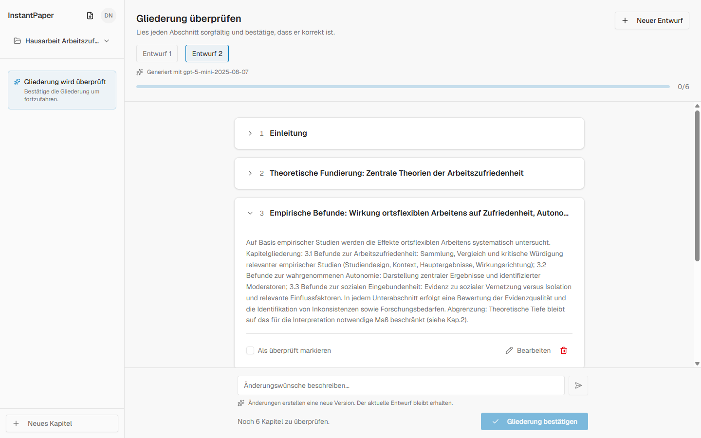
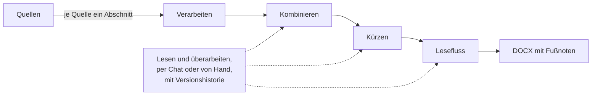
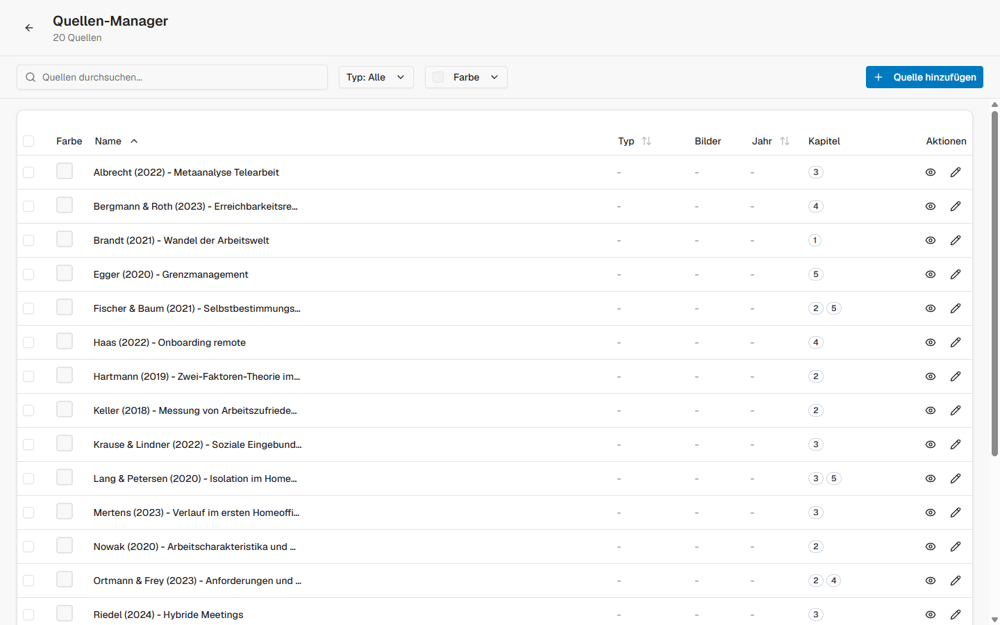
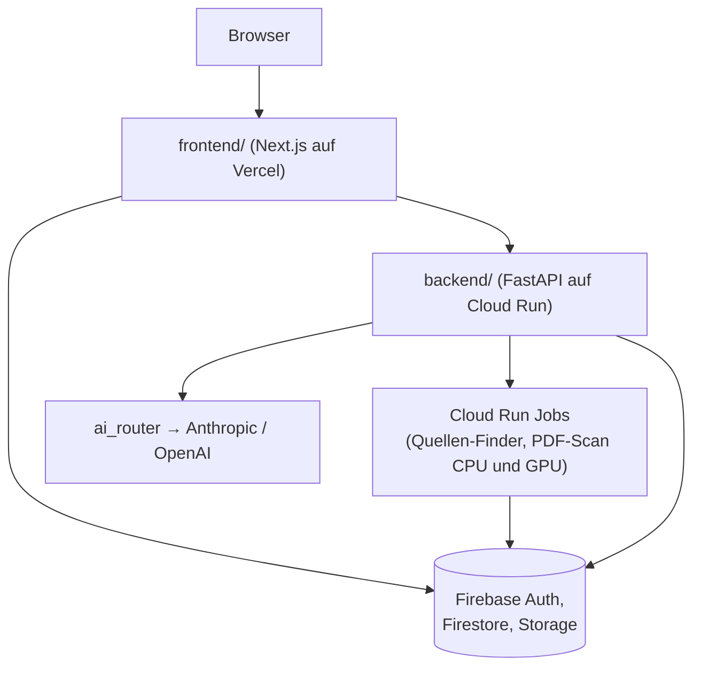

# instantpaper

Ein Schreibwerkzeug für wissenschaftliche Arbeiten: Quellen sammeln, verarbeiten
lassen, daraus belegte Textabschnitte erzeugen und den Weg dorthin
nachvollziehbar halten.

## Das Problem

Wissenschaftliches Schreiben ist zu großen Teilen Quellenarbeit: PDFs sichten,
relevante Stellen finden, Aussagen zuordnen, Belege behalten. Der Textabsatz am
Ende ist der kleinste Teil der Arbeit. instantpaper automatisiert die Schritte
davor, ohne den Beleg zu verlieren. Automatisiert heißt dabei nicht ungeprüft:
Die App ist so gebaut, dass jeder Zwischenstand, von der Gliederung bis zum
Kapiteltext, vom Nutzer gelesen, angepasst und einzeln bestätigt wird. Gebaut
habe ich es als eigenes Produkt mit dem Ziel, es zu verkaufen.


*Die Screenshots zeigen ein Beispielprojekt, alle Quellen darin sind erfunden.*

## Wie eine Arbeit entsteht

Ein Projekt ist eine Arbeit mit ihrer Gliederung, ihren Quellen und ihren
Texten. Von der Aufgabenstellung zum fertigen Kapitel sind es vier Schritte.

**Gliederung.** Aus der Aufgabenstellung und der Kapitelübersicht der
Kursunterlagen generiert das System einen Gliederungsentwurf: je Kapitel ein
Thema, die zugehörigen Unterlagen-Kapitel mit Seitenangaben und eine kurze
Begründung. Der Entwurf lässt sich per Anweisung verfeinern, und jede
Verfeinerung wird eine neue Version in einem Versionsbaum. Übernommen wird die
Gliederung erst, wenn der Nutzer jeden einzelnen Gliederungspunkt gelesen und
als überprüft abgehakt hat. Solange auch nur ein Kapitel unbestätigt ist,
bleibt der Bestätigen-Knopf gesperrt.



**Quellen.** Eine Quelle ist in instantpaper ein Textdokument mit Zitatangabe.
Es gibt drei Wege, an Quellen zu kommen: selbst anlegen im Quellen-Manager,
wissenschaftliche Literatur im Netz finden mit dem Quellen-Finder, oder eigene
PDFs mit dem PDF-Scan nach relevanten Stellen durchsuchen. Die drei Werkzeuge
sind weiter unten genauer beschrieben.

**Schreiben.** Pro Kapitel startet man einen Verarbeitungslauf. Jede Quelle
wird darin einzeln verarbeitet: das Modell bekommt das Kapitelthema, den
Quellentext und das fertige Kurzzitat, und schreibt daraus einen belegten
Abschnitt. Gibt die Quelle für dieses Kapitel nichts her, meldet der Lauf genau
das, statt etwas zu erfinden. Danach werden die Abschnitte zu einem Kapiteltext
kombiniert, bei mehr als fünf Texten hierarchisch in Gruppen. Ein
Kürzungsschritt entfernt Dopplungen, auch gegen die anderen Kapitel, damit sich
die Arbeit nicht wiederholt, und ein letzter Schritt glättet den Lesefluss.
Jede dieser Stufen bleibt ein Entwurf, den der Nutzer liest und dann im Chat
per Anweisung überarbeitet oder direkt von Hand umschreibt, mit
Versionshistorie über alle Änderungen. Nichts davon ist als fertig gedacht,
bevor es nicht gegengelesen wurde.

**Export.** Die fertigen Kapitel werden als DOCX exportiert. Die Klammer-Zitate
im Text werden dabei erkannt und als echte Word-Fußnoten eingebaut, kaputte
Zitate repariert vorher ein eigener Modell-Aufruf.



## Die drei Quellen-Werkzeuge

**Quellen-Manager.** Hier liegen alle Quellen eines Projekts. Eine Quelle
besteht aus dem selbst eingepflegten Text, also genau dem Ausschnitt, den der
Nutzer gelesen und für relevant befunden hat, und der Zitatangabe. Wie die
Quelle später im Kapiteltext zitiert wird, ist je Quelle einstellbar:
automatisch als Autor und Jahr aus der Zitatangabe, als Vollzitat, als eigener
Kurztext oder gar nicht. Dazu kommen bis zu neun Bilder je Quelle, etwa für
Abbildungen und Tabellen, Farben zum Gruppieren, Suche und Filter, und die
Zuordnung zu einem oder mehreren Kapiteln. Eine Quelle kommt also nicht
ungelesen ins System: was drinsteht, hat der Nutzer selbst ausgewählt.



**Quellen-Finder.** Sucht wissenschaftliche Literatur über die offenen
Datenbanken OpenAlex und Semantic Scholar. Dahinter steht eine Pipeline mit 13
Schritten, deren Fortschritt und Kosten live in der Oberfläche stehen: Ein
Planungs-Modell zerlegt das Kapitelthema zuerst in inhaltliche Facetten und
baut daraus Suchanfragen in mehreren Varianten und Sprachen. Die Treffer beider
Datenbanken werden zusammengeführt, per Embeddings gegen das Kapitelthema
vorsortiert, mit Abdeckungs-Markierungen versehen und von einem
Bewertungs-Modell nachgeordnet. Die Ergebnisse kommen in zwei Schienen zurück:
Arbeiten, die thematisch genau zum Kapitel passen, und grundlegende,
vielzitierte Werke der jeweiligen Debatte. Jeder Treffer ist eine Quellenkarte
mit Titel, Autoren, Jahr, Venue, DOI, Abstract, Zitationszahlen und einer
Begründung, warum er vorgeschlagen wird. Was davon in die Arbeit einfließt,
entscheidet der Nutzer beim Sichten der Karten.

**PDF-Scan.** Durchsucht hochgeladene PDFs kapitelweise nach brauchbaren
Stellen. Ein CPU-Teil parst und normalisiert die PDFs und macht ein erstes
Retrieval über Embeddings, ein GPU-Teil bewertet die Kandidaten mit einem
Cross-Encoder-Modell und einem LLM-Urteil nach. Das Ergebnis je Kapitel und
PDF: welche Abschnitte relevant sind, mit Abschnittstitel, einer Bewertung und
Seitenangaben. Der Scan ersetzt das Lesen nicht, er sagt, wo sich das Lesen
lohnt, und die Seitenangaben führen direkt an die Stelle im eigenen PDF.

Die Scan-Pipeline ist gemessen statt geraten gebaut: Unter
`testing-scripts/pdf-scan/benchmark/` liegt ein Auswertungsaufbau mit
Kapitelspezifikationen, manuellen Relevanzurteilen und einer Bewertungsrubrik,
gegen den die Pipeline-Varianten verglichen wurden.

## Architektur



Das Frontend spricht für Anmeldung und Live-Daten direkt mit Firebase. Für
alles, was das Backend braucht, laufen die Anfragen über Route Handlers im
Frontend, die das Anmelde-Token prüfen und die Anfrage weiterreichen. Das
Backend ist eine FastAPI-Anwendung auf Cloud Run und führt alle Schreib- und
Modellzugriffe aus.

Alle Modellaufrufe laufen über eine einzige Stelle,
`backend/services/ai_router.py`, die Anfragen auf Anthropic und OpenAI
verteilt. Ein Ausfall oder eine Preisänderung bei einem Anbieter legt das
Produkt so nicht still, und ein Modellwechsel ist eine Konfigurationsfrage
statt einer Änderung an dreißig Aufrufstellen.

Die schwere Arbeit läuft nicht im Request. Die PDF-Verarbeitung braucht
Minuten, nicht Millisekunden, deshalb läuft sie als Cloud Run Job mit
getrennten CPU- und GPU-Pfaden (`backend/services/pdf_scan/cpu_job.py`,
`gpu_job.py`) und einem definierten Übergabepunkt (`handoff.py`): der CPU-Job
packt seine Zwischenergebnisse als geprüftes Bundle in den Storage, der GPU-Job
stellt es wieder her und macht weiter. Die API nimmt an, stellt ein, antwortet
sofort.

Der Rückweg der Ergebnisse läuft über Firestore: Der Job schreibt seinen
Status und sein Ergebnis dorthin, und das Frontend hat auf genau diese
Dokumente Echtzeit-Listener. Es gibt also kein Polling, das Ergebnis erscheint
in der Oberfläche, sobald es da ist.

Die Abrechnung läuft getrennt: Checkout-Sitzungen entstehen über
Firestore-Dokumente, die die Firebase-Stripe-Erweiterung verarbeitet, und das
Backend spiegelt daraus Abrechnungsstand und Guthaben.

## Guthaben und Kosten

Bezahlt wird über Stripe, verbraucht wird Guthaben. Es gibt zwei Töpfe:
Abo-Guthaben verfällt am Ende des Monats, gekauftes Guthaben bleibt. Das Modell
habe ich in einer ähnlichen App gesehen und übernommen, weil verfallende
Credits verhindern, dass sich Guthaben über Monate anstaut und dann auf einmal
ausgegeben wird. So bleibt die Last pro Monat kalkulierbar, und Nutzer heben
ihr Guthaben nicht aus Angst vor dem Verbrauch auf.

Bei nutzungsabhängigen LLM-Kosten entscheidet die Kostenkontrolle über die
Marge, deshalb sind Kosten hier ein Feature und kein Nebeneffekt. Vier
Services teilen sich die Arbeit: `openai_estimation_service` schätzt die
Kosten vor dem Aufruf, `openai_budget_service` reserviert dafür Guthaben und
deckelt laufende Jobs, `cost_service` erfasst nach dem Aufruf die
tatsächlichen Token und Kosten in einem unveränderlichen Log, und
`credits_service` führt das Guthaben als Konto mit Buchungsjournal. Die beiden
erstgenannten gibt es nur für OpenAI, denn dort liefen mit den Embeddings und
Bewertungen der Quellen-Werkzeuge die massenhaften und damit teuren Aufrufe.
Was ein Lauf gekostet hat, steht für den Nutzer sichtbar direkt am Lauf.

## Zugang und Betrieb

Die App war nie offen registrierbar. Ein neues Konto landet nach der Anmeldung
auf einer Warteseite und braucht eine Freischaltung oder einen Zugangscode.
Das war für den Anfang gedacht, um den Zugang im Griff zu behalten, bis das
Produkt richtig läuft, und über diesen Anfang ist das Projekt nie
hinausgekommen.

Der Betreiber-Teil ist der größte einzelne Block des Backends, 41 der 90
API-Routen gehören ihm. Über den Admin-Bereich werden Nutzer freigeschaltet,
blockiert und ihre Feature-Flags gesetzt, Zugangscodes verwaltet, Guthaben
manuell gebucht und Ausgabenlimits je Nutzer gesetzt. Dazu kommen eine
Kostenübersicht über die ganze Plattform und die Einsicht in Projekte, Quellen
und Statistiken einzelner Nutzer samt Löschrecht. Daneben existiert ein
zweiter, einfacherer Freischaltweg über eine passwortgeschützte Seite, der
ohne Admin-Konto im Browser funktioniert.


## Aufbau

```text
frontend/          Next.js 16, React 19, TypeScript, Tailwind 4
backend/           FastAPI, Worker-Einstiegspunkte, Dockerfiles
testing-scripts/   Experimente, Benchmarks, Auswertungen — nicht im Produktionspfad
functions/         Alte Firebase Functions, nicht mehr im Deploy-Pfad
firestore.rules    Firestore-Regeln
storage.rules      Storage-Regeln
```

`frontend/` und `backend/` genügen, um die Anwendung zu betreiben.
`testing-scripts/` ist bewusst außerhalb, denn es ist groß, laut und für den
Betrieb irrelevant.

[frontend/README.md](frontend/README.md) und
[backend/README.md](backend/README.md) vertiefen die beiden Hälften, alles
Wesentliche über das Projekt steht aber hier.

## Lokal starten

```bash
cd frontend && cp .env.local.example .env.local && npm install && npm run dev
cd backend  && cp .env.example .env        && pip install -r requirements.txt && python main.py
```

Frontend auf `:3000`, API auf `:8000`. Die erwarteten Konfigurationswerte
stehen in den beiden `.example`-Dateien. Ohne ein eigenes Firebase-Projekt und
API-Schlüssel startet die Anwendung zwar, aber Anmeldung und Verarbeitung
brauchen die echten Dienste.

## Deployment

Frontend auf Vercel mit `frontend/` als Wurzelverzeichnis. Backend über
[deploy-backend.yml](.github/workflows/deploy-backend.yml) auf Cloud Run, die
schweren Läufe als eigene Cloud Run Jobs. Die Authentifizierung des Deployments
läuft über Workload Identity Federation statt über hinterlegte Schlüssel.

## Tests

Tests liegen als 18 einzelne `test_*.py`-Skripte im Repository, jedes prüft
eine einzelne Integration gegen die laufende Umgebung. Sie laufen nicht
automatisch, einen Test-Runner oder eine CI-Prüfung gibt es nicht. Die
Verifikation lief über den Auswertungsaufbau unter `testing-scripts/` und über
manuelle Proben.

## Prompts

Die Prompt-Texte sind in diesem Repository durch Platzhalter ersetzt. Die
Anwendung lädt sie zur Laufzeit aus Firestore, wo sie über den Admin-Bereich
gepflegt und versioniert werden, im Code standen sie nur als Startwerte.

## Zu diesem Repository

446 Commits von Dezember 2025 bis Mai 2026, veröffentlichte Kopie eines
privaten Repositories, Stand Juli 2026. Gebaut habe ich es mit Coding-Agenten.
Der Entwurf und die Entscheidungen sind meine, den Code hat die KI geschrieben.

**Nicht mehr deployt.** Das Produkt war vollständig gebaut, inklusive
Abrechnung mit Guthaben, Staging- und Produktionsumgebung. Vermarktet wurde es
nie, zahlende Nutzer gab es nicht.

Aus der veröffentlichten Fassung entfernt: Betriebsdaten mit personenbezogenen
Angaben, ein internes Betriebshandbuch, die Prompt-Texte und fremde
Verlagsdokumente aus dem Benchmark-Korpus.

## Lizenz

Alle Rechte vorbehalten. Dieses Repository dient als Arbeitsprobe,
Nachnutzung nur nach Absprache.
